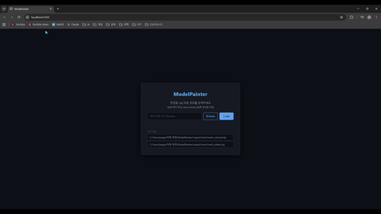
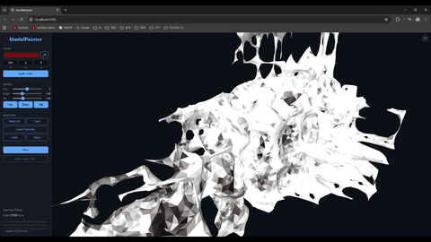
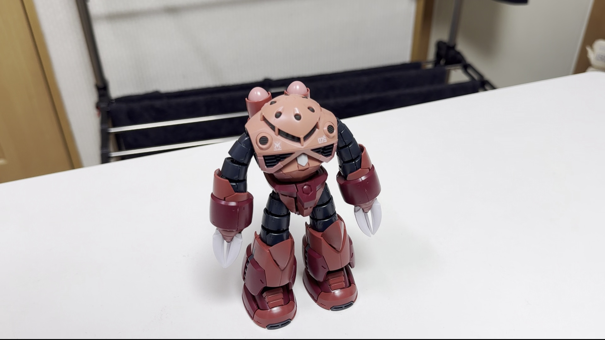
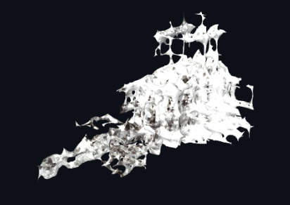
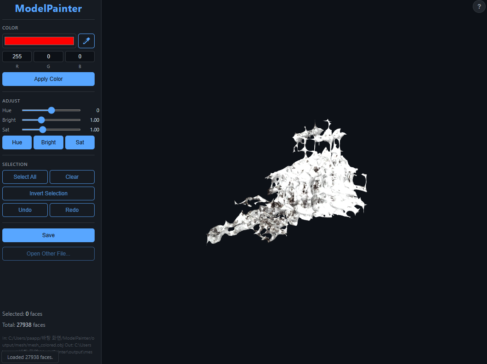
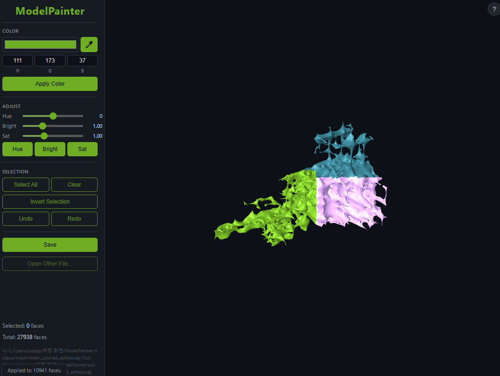

# ModelPainter

Started from a simple thought after assembling a plastic model kit: *"What would this look like painted in that color?"*  
Given a single video, this program reconstructs a 3D model via NeRF and lets you preview any color scheme on it before picking up a brush.

---




### Frames → Training
| Before | After |
|--------|-------|
|  |  |

> **Common reasons reconstruction fails**
> - **Motion blur** — moving the camera too fast smears frames and breaks pose estimation
> - **Reflective or glossy surfaces** — plastic kits with bare plastic or metallic paint confuse NeRF; prime or apply matte finish first
> - **Inconsistent lighting** — shadows shifting between frames (e.g. hand blocking a light) corrupt the radiance field
> - **Incomplete coverage** — skipping the top, bottom, or back of the object leaves holes in the mesh
> - **Thin or transparent parts** — antennas, clear parts, and fine details have too little density to reconstruct


### Color Editing — Before & After
| Before | After |
|--------|-------|
|  |  |

**Pipeline Output Preview**
| Stage | Output |
|-------|--------|
| Frame extraction | `output/frames/frame_XXXX.jpg` |
| NeRF training | `output/checkpoints/nerf_final.pth` |
| Mesh extraction | `output/mesh/mesh.obj` |
| Color baking | `output/mesh/mesh_colored.obj` |
| After color editing | `output/mesh/mesh_edited.obj` |


---

## Pipeline

```
Video input (.mp4 / .mov)
    ↓
1. Frame Extraction     — uniformly sample frames + blur filtering
    ↓
2. COLMAP               — automatic camera intrinsics & pose estimation
    ↓
3. NeRF Training        — custom PyTorch NeRF implementation
    ↓
4. Mesh Extraction      — Marching Cubes + Laplacian smoothing
    ↓
5. Color Baking         — NeRF density → per-face color extraction
    ↓
6. Color Editor         — browser-based 3D color editor
```

---

## Requirements

- Python 3.12
- CUDA-capable GPU (developed on RTX 4060 Ti 8GB)
- [COLMAP](https://colmap.github.io/) installed and added to PATH

```bash
pip install -r requirements.txt
```

---

## Usage

### Filming Tips (Important)

For best results, keep the following in mind when recording your subject:

- Shoot in good, even lighting — avoid harsh shadows or overexposed highlights.
- Move the camera slowly and continuously around the object, covering all angles.
- Keep the subject centered and fully in frame throughout the video.
- Aim for at least 100–200 sharp frames; blurry or motion-streaked frames hurt reconstruction.

### Full Pipeline

```bash
python main.py --video input.mp4
```

### Recommended Options

```bash
python main.py --video input.mp4 \
    --num_epochs 200 \
    --resolution 128 \
    --img_size 800 450
```

### Skipping Stages

```bash
# Frames and COLMAP already done — retrain NeRF only
python main.py --skip_extract --skip_colmap --video input.mp4

# Extract mesh from an existing checkpoint
python main.py --skip_extract --skip_colmap --skip_train \
    --checkpoint output/checkpoints/nerf_final.pth

# Resume interrupted training
python main.py --skip_extract --skip_colmap \
    --resume output/checkpoints/nerf_epoch_0100.pth \
    --num_epochs 200
```

### Viewer Only

```bash
python -c "from editor.viewer import launch_viewer; launch_viewer()"
```

A browser window will open automatically. Select a `.obj` file via the file picker or type the path directly.

---

## Arguments

| Argument | Default | Description |
|----------|---------|-------------|
| `--video` | — | Input video path (required unless `--skip_extract` is set) |
| `--output` | `./output` | Output directory |
| `--num_frames` | `200` | Maximum number of frames to extract |
| `--blur_threshold` | `30.0` | Blur filter threshold (lower = stricter) |
| `--num_epochs` | `20` | Number of NeRF training epochs |
| `--batch_size` | `4096` | Ray batch size per epoch |
| `--rays_per_epoch` | `None` | Max rays per epoch (use to cap runtime on large scenes) |
| `--img_size` | `400 225` | Training image resolution `W H` |
| `--resolution` | `128` | Marching Cubes resolution (higher = more mesh detail) |
| `--near` | auto | Near plane (auto-computed from scene if unset) |
| `--far` | auto | Far plane (auto-computed from scene if unset) |
| `--threshold` | auto | Density threshold (defaults to 95th percentile) |
| `--smooth_iter` | `3` | Laplacian smoothing iterations (`0` = off) |
| `--skip_extract` | — | Skip frame extraction |
| `--skip_colmap` | — | Skip COLMAP reconstruction |
| `--skip_train` | — | Skip training and load from checkpoint |
| `--checkpoint` | — | Checkpoint path to load when `--skip_train` is set |
| `--resume` | — | Checkpoint path to resume training from |
| `--device` | `cuda` | Compute device (`cuda` / `cpu`) |

---

## Viewer Controls

| Action | Method |
|--------|--------|
| Rotate | Left-click drag |
| Pan | Middle-click drag |
| Zoom | Scroll wheel |
| Select face | Click |
| Multi-select | Shift + click |
| Box select | Right-click drag |
| Apply color | RGB / Color Picker → Apply Color |
| HSV adjust | Slider → Hue / Bright / Sat button |
| Pick color | Eyedropper button (or `P`) → click a face |
| Select all | `Ctrl+A` |
| Invert selection | `I` |
| Deselect | `Esc` |
| Undo | `Ctrl+Z` |
| Redo | `Ctrl+Y` / `Ctrl+Shift+Z` |
| Save | `Ctrl+S` |

The saved file is written as `*_edited.obj` in the same folder as the input file.

---

## Output Structure

```
output/
├── frames/               # extracted frame images
├── colmap/
│   ├── colmap.db
│   ├── sparse/           # COLMAP sparse reconstruction
│   └── transforms.json   # camera parameters for NeRF training
├── checkpoints/
│   ├── nerf_epoch_XXXX.pth
│   └── nerf_final.pth
└── mesh/
    ├── mesh.obj           # raw mesh (no color)
    ├── mesh_colored.obj   # mesh with baked colors
    └── mesh_edited.obj    # mesh after viewer edits
```

---

## Project Structure

```
ModelPainter/
├── main.py
├── requirements.txt
├── NeRF/
│   ├── model.py           # positional encoding + MLP
│   ├── dataset.py         # ray sampling
│   ├── renderer.py        # volume rendering
│   └── trainer.py         # training loop
├── colmap/
│   └── reconstructor.py   # pycolmap wrapper
├── frame_extraction/
│   └── frame_extractor.py # frame extraction + blur filtering
├── mesh/
│   ├── mesh_extractor.py  # Marching Cubes + smoothing
│   └── color_baker.py     # NeRF → per-face color baking
└── editor/
    ├── color_editor.py    # RGB / HSV edit logic
    └── viewer.py          # Flask + Three.js viewer
```

---

## TODO

- [ ] NeRF training speed improvement
- [ ] Model reconstruction accuracy improvement

---

## Goals

- Understand 3D reconstruction fundamentals by implementing NeRF from scratch
- Implement per-face RGB / HSV color editing on extracted meshes
- Build a complete end-to-end pipeline from raw video to color-editable 3D model
